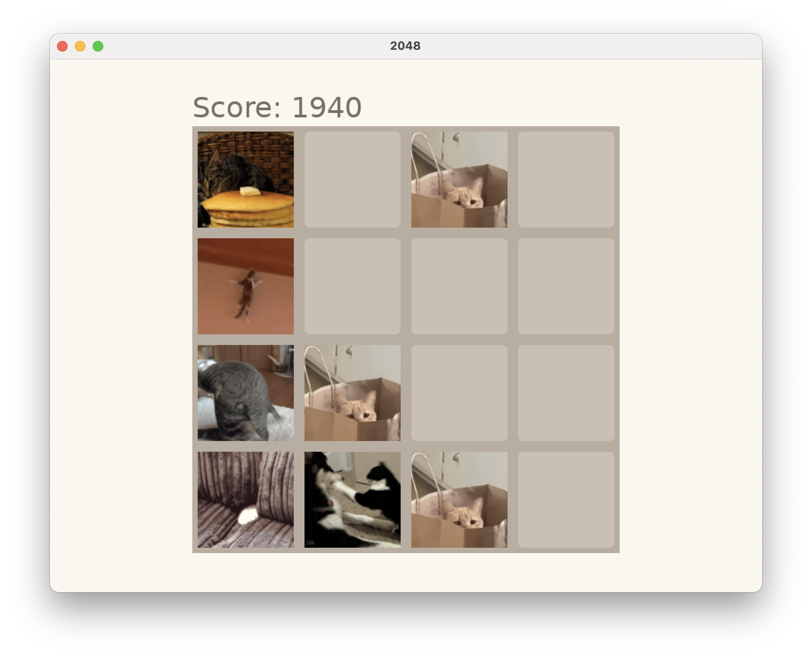

# 2048

A Love2D implementation of the 2048 puzzle game — designed to run with animated GIF tilesets so every tile value can display a custom sprite animation instead of a plain colored square.



## Requirements

- [LÖVE](https://love2d.org/) 11.x

## Play

```
make run      # normal game (win at 2048)
make dev      # win at 32 — useful for testing the win screen
```

The game opens with a **Main Menu** — Up/Down to navigate, Enter (or tap) to confirm. Select **New Game** to start playing or **Quit** to exit.

Arrow keys to slide tiles. The window is resizable.

When you create a 2048 tile a **You Win** overlay appears with two options — **Continue** (keep playing) and **Restart** — navigated with Up/Down and confirmed with Enter, or tapped directly. A **Game Over** overlay appears when no moves remain; press Enter or any arrow key (or tap) to restart.

Press `Escape` (or tap the **⏸** button in the top-left corner) to open the **Pause** menu. The board stays visible behind a dimmed overlay. Up/Down to navigate, Enter to confirm. Options: **Resume**, **New Game**, **Main Menu**, **Quit**. Pressing `Escape` again or selecting Resume returns instantly to the game.

Select **Options** from the main menu (between New Game and Quit) to open the **Options** screen. Left/Right toggles the **Win Tile** between `32` (dev) and `2048` (prod) — the same value `--win-tile` sets at launch, but changeable mid-session. Press `Escape` to return to the main menu.

## Test

```
make test-game          # pure-Lua game logic tests (no Love2D runtime needed)
make test-tool-tileset  # tileset-builder Python tests
make test-tool-dl       # curl-giphy Python tests
make test-tool-theme    # theme-builder Python tests
make test-all           # all of the above
```

## Structure

```
game/              Love2D game source
  main.lua         entry point (Love2D callbacks)
  config.lua       constants and tile color map
  statemachine.lua state machine (switch, lifecycle dispatch)
  gamestate.lua    game state tables (menu, playing, paused, win, game_over) wired onto the machine
  renderer.lua     board drawing
  menu.lua         overlay and button rendering (main menu, win, game-over, pause, options)
  options.lua      options screen state (win-tile toggle, escape back to menu)
  grid.lua         game logic — slide, merge, spawn, win/lose detection
tests/
  test_all.lua     test runner (runs all suites below)
  test_grid.lua    grid logic
  test_gamestate.lua     game state and input
  test_statemachine.lua  state machine mechanics
  test_pause.lua         pause menu behaviour
  test_menu.lua          menu button bounds
  test_main_menu.lua     main menu state and navigation
  test_options.lua       options screen state and navigation
  test_tile.lua    tile animation
  test_tileset.lua tileset loading helpers
  test_swipe.lua   swipe gesture detection
docs/prd/          product requirements
themes/            theme manifests (one Giphy URL per line) consumed by theme-builder
tools/             helper CLI tools (see below)
```

## PRD Roadmap

Recommended implementation order for triage PRDs:

| # | PRD | Notes |
|---|-----|-------|
| 011 | merge-effect | Pure visual add; `merged` flag already in tile data from slide animation. |
| 012+ | tileset-picker · animation-effect-toggles · settings-persistence | All need options screen first (now available — see PRD 010). |
| — | sound-hooks · refactor-renderer-split | Independent; pick up when the time feels right. |

**Flag:** `touch-swipe` is in triage but `swipe.lua` is already wired in `main.lua`. Verify before triaging — it may already be done.

## Tools

### curl-giphy

Downloads a GIF from a Giphy page URL and saves it to the current directory.

```
make dl URL=https://giphy.com/gifs/<slug>
```

### tileset-builder

Converts a set of GIFs into a PNG sprite sheet compatible with the game's tileset loader. Each GIF becomes one row (one tile value); animation frames are preserved.

```sh
cd tools/tileset-builder
source .venv/bin/activate
python tilesheet.py create tile_2.gif tile_4.gif tile_8.gif ...
```

See `tools/tileset-builder/README.md` for the full usage and output format.

### theme-builder

Turns a theme manifest (`themes/<name>.txt`, one Giphy URL per line, line order = tile value order) into a ready-to-use tilesheet in one command — orchestrates `curl-giphy` and `tileset-builder` without modifying either.

```
make theme NAME=jurassic-park
```

Downloaded GIFs are cached under `themes/<name>/raw/` so reruns only re-download lines that changed. Output lands in `game/assets/<name>.png` plus its `.lua` sidecar. See `tools/theme-builder/docs/prd/theme-builder.md` for design details.
